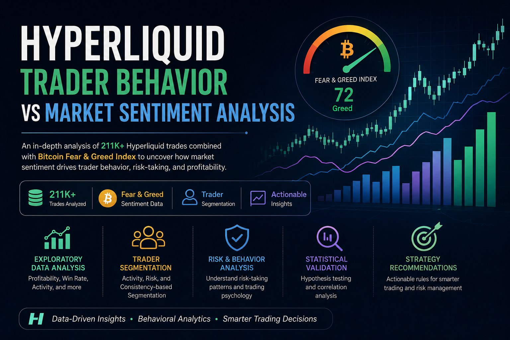

# Hyperliquid Trader Behavior vs Market Sentiment Analysis



---

## Overview

This project analyzes how Bitcoin market sentiment influences trader behavior and performance on Hyperliquid using over **211,000 real trading records** combined with the **Bitcoin Fear & Greed Index**.

The analysis explores:

* trader profitability,
* trading frequency,
* risk-taking behavior,
* position sizing,
* long vs short participation,
* and behavioral segmentation across different market sentiment regimes.

The objective is to uncover actionable behavioral patterns that can support smarter trading and risk-management strategies.

---

# Objectives

This project investigates:

* Does trader profitability differ between Fear and Greed market conditions?
* Do traders change behavior based on sentiment?
* Which trader archetypes perform better?
* What behavioral patterns correlate with profitability?
* Can sentiment-driven insights improve trading strategies?

---

# Dataset Information

## 1. Bitcoin Fear & Greed Dataset

Contains:

* Daily sentiment classification
* Fear & Greed index values
* Historical market psychology indicators

### Columns

* `date`
* `classification`
* `value`

---

## 2. Hyperliquid Historical Trader Dataset

Contains:

* Trade execution details
* Position sizes
* Trade direction
* Profit & Loss metrics
* Trading timestamps
* Trader activity data

### Key Columns

* `Account`
* `Execution Price`
* `Size USD`
* `Closed PnL`
* `Side`
* `Timestamp IST`
* `Fee`

---

# Project Workflow

## 1. Data Cleaning & Preparation

* Missing value analysis
* Duplicate checks
* Datetime conversion
* Numeric datatype standardization
* Daily date alignment

---

## 2. Feature Engineering

Created:

* Daily trader PnL
* Win rate
* Trade frequency
* Average trade size
* Risk proxy metrics
* Sentiment-level summaries
* Behavioral segmentation features

---

## 3. Exploratory Data Analysis (EDA)

Analyzed:

* Profitability across market sentiments
* Win rate behavior
* Trading activity distribution
* Long vs short participation
* Correlation analysis
* Statistical significance testing

---

## 4. Trader Segmentation

Traders were segmented into:

* Frequent vs Infrequent Traders
* High Risk vs Low Risk Traders
* Consistent vs Inconsistent Traders

Behavioral archetypes were identified using:

* profitability,
* volatility,
* trade activity,
* and execution consistency.

---

# Key Findings

## Market Sentiment Influences Trader Behavior

Fear and Greed conditions significantly affected:

* trading frequency,
* position sizing,
* directional participation,
* and risk appetite.

---

## Extreme Greed Produced Higher Win Rates

Traders achieved their highest average win rates during Extreme Greed conditions, suggesting momentum-driven environments may create favorable short-term trading opportunities.

---

## Fear Markets Triggered Larger Position Sizes

Fear periods showed:

* larger average trade sizes,
* increased trading activity,
* and elevated volatility exposure.

This suggests more aggressive and emotional participation during uncertain markets.

---

## High Profitability Often Correlated With Higher Risk

Many highly profitable traders also exhibited:

* large PnL volatility,
* inconsistent performance,
* and aggressive trading behavior.

---

## Consistency Favored Sustainability

Consistent traders generally showed:

* lower volatility,
* better risk control,
* and more stable performance patterns.

---

# Statistical Insights

A two-sample t-test comparing Fear vs Greed profitability produced:

* **T-Statistic:** ~1.85
* **P-Value:** ~0.064

### Result

Profitability differences between Fear and Greed periods were not strongly statistically significant at the 95% confidence level.

Behavioral factors appeared more influential than sentiment alone.

---

# Strategy Recommendations

## 1. Reduce Aggressive Exposure During Fear Markets

* Lower leverage
* Reduce position sizing
* Avoid emotionally reactive overtrading

---

## 2. Momentum Strategies Perform Better During Greed Regimes

* Higher win rates observed during bullish sentiment environments
* Trend-following setups may become more effective

---

## 3. Prioritize Consistency Over Extreme Risk

* Stable execution and disciplined risk management produced more sustainable performance patterns

---

# Technologies Used

* Python
* Pandas
* NumPy
* Matplotlib
* Seaborn
* SciPy
* Scikit-learn
* Google Colab

---

# Statistical & Analytical Techniques

* Feature Engineering
* Behavioral Analytics
* Trader Segmentation
* Correlation Analysis
* Sentiment Analysis
* Hypothesis Testing
* Risk Profiling

---

# Repository Structure

```bash
├── Hyperliquid_Sentiment_Analysis.ipynb
├── README.md
├── requirements.txt
├── cover.png
└── data/
```

---

# Future Improvements

Potential future enhancements include:

* predictive profitability modeling,
* advanced clustering techniques,
* volatility forecasting,
* interactive Streamlit dashboards,
* and portfolio-level risk analysis.

---

# Final Conclusion

The analysis demonstrates that:

* market sentiment shapes trader psychology,
* trader psychology influences behavior,
* and behavior ultimately impacts profitability.

The findings suggest that disciplined execution and risk management are more important than sentiment direction alone in highly volatile crypto trading environments.
